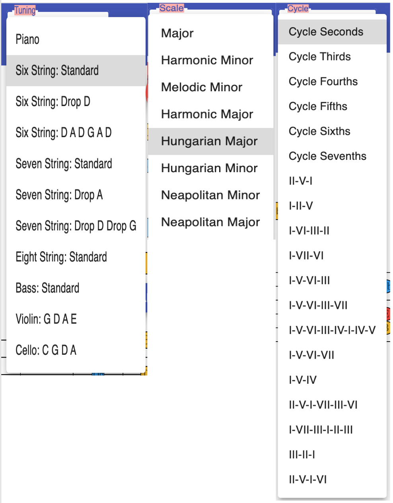
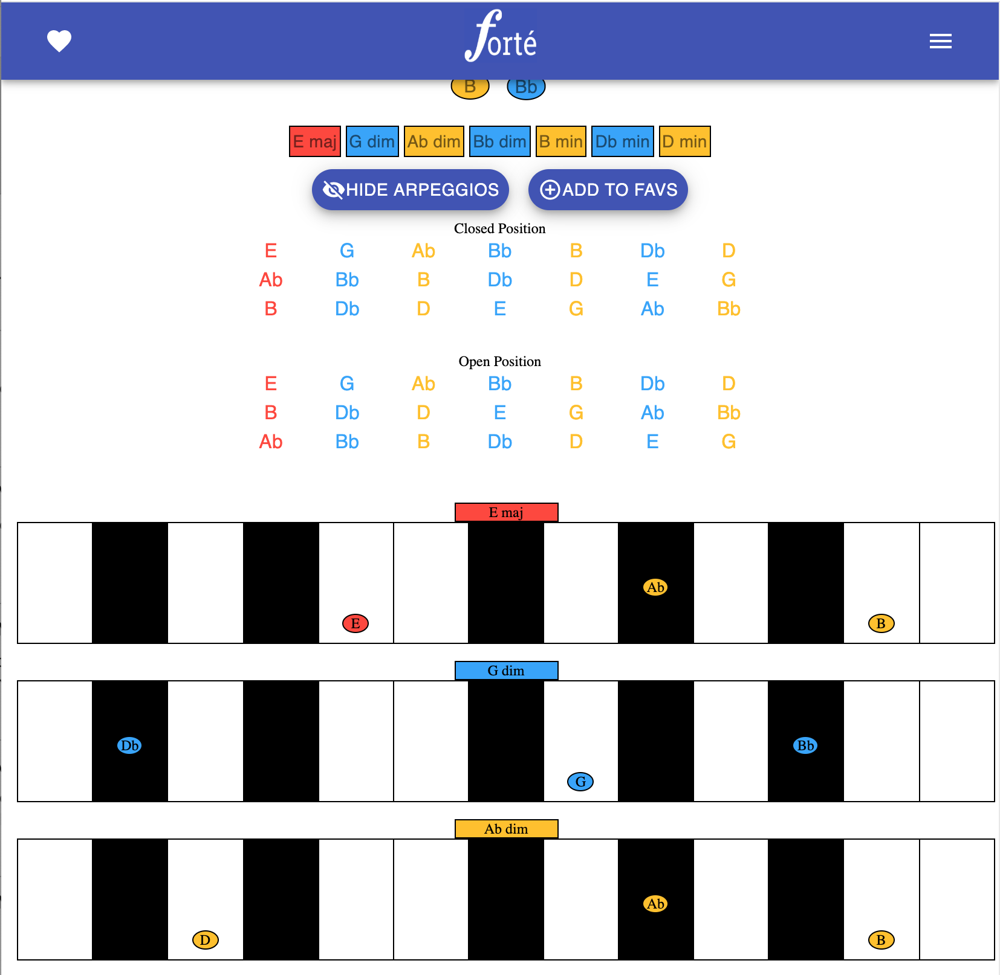
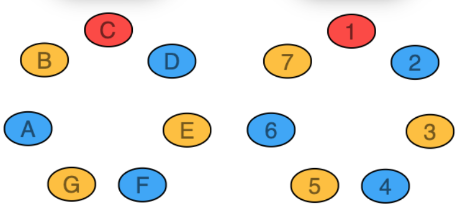

# Forté - Scale Encyclopedia

> _This application began as way for me to learn more about web developement and programming but quickly evolved into a tool that combined my knowledge of music with this path I've been taking into the world of CS. I hope this is useful from an educational standpoint and helps demonstrates a few of my skills as a programmer. - Paul_

## Overview

Forté provides a colourful and dynamic way to visualize musical scales, chords and modes for multiple instruments.

Every scale, chord and mode has been algorithmically generated to provide a venerable encyclopedia for musicians of any background.

## Designed mobile first:

  

## Optimized for desktop use:

  

## Choose from multiple tunings, scales and cycles:

  

## Break out scales into arpeggios:

  

## Save your favourite scales ❤️:

  

## View notes as numbers

  

## Triads as Seventh Chords

  

Keep an eye out for incremental improvements in the future!

© Paul J. Walsh
