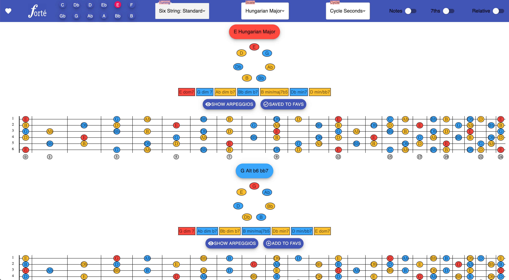
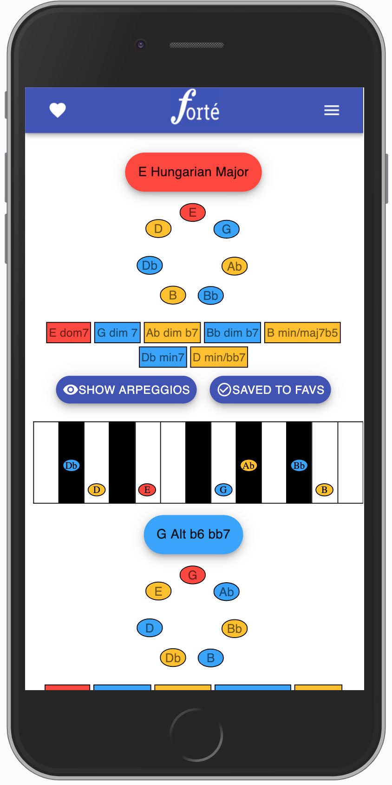
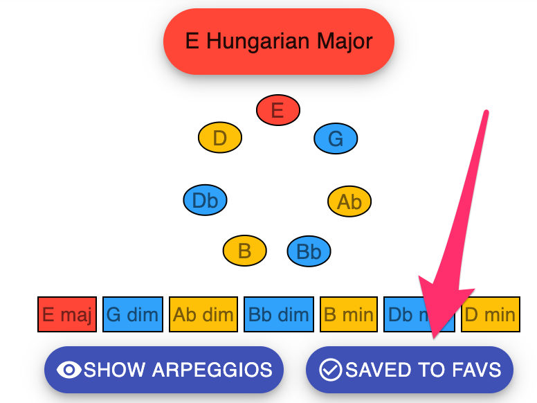

The Forté web app provides a colourful and dynamic way to visualize musical scales, chords and modes with an easy to use interface.

Every scale, chord and mode has been algorithmically generated to provide a venerable encylopedia for musicians of any background.

Forté is optimized for desktop use:

But it is also designed for mobile use:

In addition to viewing scales in their complete form you break them out into arpeggios and view them in cycles:

Forté also features the ability to save your favourite scales to your browser's local storage:

Inside the favourites menu you can access all of the same features, and remove scales you no longer use:

I hope you have fun trying out Forté and keep an eye out for incremental improvements in the future!

_This application was started as an exercise to learn more about web developement and programming but quickly evolved into a tool that combined my knowledge from two different fields. I hope this application is both useful from an educational standpoint and demonstrates a few of my skills as a programmer._

© Paul J. Walsh
